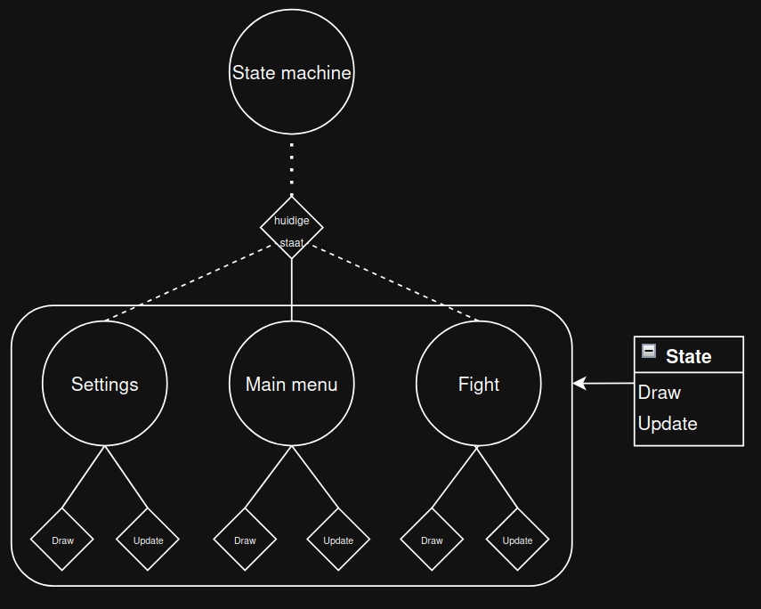

# States
Documentatie over states en de statemachine


- [Basis informatie](#basis)
- [Statemachine](#statemachine)
- [States](#states)
  - [Voorbeeld](#voorbeeld-state)

---

## <a name="basis"></a>Basis informatie

Games bestaan (meestal) niet uit een enkele while loop.
De meeste games bestaan uit meerde staten (main menu, settings, fight, etc.), hiervoor gebruiken we een statemachine.
De statemachine is verantwoordelijk voor bijhouden welke state momenteel actief is en de benodigde functies aan te roepen in de juiste staat.



---

## Statemachine

De statemachine voor pokermon heeft 3 taken: de huidige staat bijhouden, zorgen dat de states de benodigde informatie hebben en de transitie tussen states aansturen.

## Functies

---

### start_transitie

De `start_transitie` functie wordt gebruikt om door de verschillende states te navigeren.
Ook behandelt de `start_transitie` functie de fade-in en fade-out van de states

**Parameters**
<br>
nieuwe_staat: State: De nieuwe staat om naar te veranderen
<br>
tijd: float = 0.5: Duur van de transitie in secondes

---

### update

De `update` functie wordt gebruikt om de StateMachine te updaten tijdens transities.
Ook zorgt de `update` functie dat de huidige staat wordt ge-update, inclusief knoppen.

**Deze functie is niet bedoeld om op meerdere plekken aan te roepen maar alleen in de game loop**

---

### draw

De `draw` functie wordt gebruikt om de huidige staat te tekenen.
Ook tekent de `draw` functie het fade-out en fade-in effect tijdens transities.

**Deze functie is niet bedoeld om op meerdere plekken aan te roepen maar alleen in de game loop**

---

## <a name="states"></a>States

States bestaan uit verschillende classes die allemaal van de `State` class erven.
Dit betekent dat alle States de `update` en `draw` functies hebben, maar hun eigen code hebben om te runnen.
Ook hebben alle States hun eigen lijst met buttons, deze lijst wordt door de [StateMachine](#statemachine) gebruikt om alle buttons te controleren voor clicks en hun functies aan te roepen.


## Functies

---

### update

De `update` functie is bedoeld voor game-updates zoals keyboard input behandelen.
Deze functie wordt door elke `State` overschreven en heeft dus in elke `State` een andere functie.

---

### draw

De `draw` functie is bedoeld om de game graphics van de huidige `State` te renderen op het scherm.
Deze functie wordt door elke `State` overschreven en heeft dus in elke `State` een andere functie.

---

## Voorbeeld State

Hieronder kan je een voorbeeld zien van een functionele `State`.

Deze `State` heeft een zwarte achtergrond met een wit vierkant en checked of de spatie balk is ingedrukt

```python
from pygame import K_SPACE

from src.engine.logger import info
from src.engine.state.state import State
from src.engine.inputManager import InputManager

class ExampleState(State):
    def __init__(self):
        super().__init__()
        
        self.background_color = "Black"
    
    def update(self, inputManager:InputManager, stateMachine):
        if inputManager.is_key_held(K_SPACE):
            info("Space bar is pressed")
    
    def draw(self, renderer):
        renderer.draw_rect("White", 100, 100, 100, 100)
```